# CI-Tools Architecture and Usage Guide

This document provides a comprehensive guide to CI-Tools architecture, codebase structure, and practical usage examples.

## Table of Contents

- [System Architecture](#system-architecture)
- [Component Architecture](#component-architecture)
- [Repository Structure](#repository-structure)
- [Core Components](#core-components)
- [Usage Examples](#usage-examples)
- [Design Patterns](#design-patterns)
- [Deployment Architecture](#deployment-architecture)
- [Security Architecture](#security-architecture)
- [Extension Points](#extension-points)

## System Architecture

The CI-Tools repository provides a distributed system of tools and services that work together to manage the OpenShift CI infrastructure. The architecture follows a microservices-like pattern where each tool has a specific responsibility.

### High-Level Architecture Diagram


## Component Architecture

### CI Operator Architecture

The CI Operator is the core orchestration engine. It follows a graph-based execution model.


### Configuration Management Flow


### Image Build and Promotion Flow


### Data Flow Diagram

```mermaid
flowchart TD
    subgraph "Input Sources"
        GH[GitHub Events]
        Config[CI Configs]
        Secrets[Secret Stores]
    end
    
    subgraph "Processing"
        Prow[Prow]
        CIOp[ci-operator]
        Controllers[Controllers]
    end
    
    subgraph "Storage"
        Registry[Image Registry]
        GCS[GCS Artifacts]
        BigQuery[BigQuery Metrics]
        Prometheus[Prometheus Metrics]
    end
    
    subgraph "Output"
        Results[Test Results]
        Images[Promoted Images]
        Reports[Reports/Dashboards]
    end
    
    GH --> Prow
    Config --> Prow
    Secrets --> Controllers
    
    Prow --> CIOp
    Controllers --> Registry
    
    CIOp --> Registry
    CIOp --> GCS
    CIOp --> BigQuery
    
    Controllers --> Prometheus
    
    Registry --> Images
    GCS --> Results
    BigQuery --> Reports
    Prometheus --> Reports
```



## Repository Structure

The CI-Tools repository follows a standard Go project layout with clear separation of concerns:

```
ci-tools/
├── cmd/                    # Command-line tools and applications
├── pkg/                    # Shared libraries and packages
├── test/                   # Test files and test data
├── hack/                   # Build scripts and utilities
├── images/                 # Container image definitions
├── vendor/                 # Vendored dependencies
├── docs/                   # Documentation
├── Makefile               # Build automation
├── go.mod                  # Go module definition
└── README.md              # Main README
```

### `/cmd` - Command-Line Tools

This directory contains all executable tools. Each subdirectory represents a standalone command-line application. See individual `cmd/<tool-name>/README.md` files for detailed documentation.

**Core CI Tools:**
- `ci-operator/` - Main CI orchestration engine
- `ci-operator-prowgen/` - Generates Prow jobs from ci-operator configs
- `ci-operator-checkconfig/` - Validates ci-operator configurations
- `ci-operator-configresolver/` - Resolves ci-operator config references

**Configuration Management:**
- `config-brancher/` - Propagates configs to release branches
- `autoconfigbrancher/` - Orchestrates multiple config tools
- `determinize-ci-operator/` - Normalizes CI configs
- `ci-operator-yaml-creator/` - Creates CI configs from templates

**Image Management:**
- `registry-replacer/` - Replaces registry references
- `ci-images-mirror/` - Mirrors images between registries
- `promoted-image-governor/` - Manages image promotion
- `clusterimageset-updater/` - Updates cluster image sets

**Secret Management:**
- `ci-secret-generator/` - Generates secrets from templates
- `ci-secret-bootstrap/` - Bootstraps secrets for repos
- `gsm-secret-sync/` - Syncs secrets from Google Secret Manager
- `vault-secret-collection-manager/` - Web UI for Vault secrets

**Cluster Management:**
- `cluster-init/` - Initializes test clusters
- `dptp-controller-manager/` - Main Kubernetes controller manager
- `cluster-display/` - Displays cluster information

**Job Management:**
- `prow-job-dispatcher/` - Dispatches jobs to clusters
- `job-run-aggregator/` - Aggregates job run data
- `result-aggregator/` - Aggregates test results
- `retester/` - Retests failed jobs

**Developer Tools:**
- `repo-init/` - Web UI/API for repo initialization
- `prcreator/` - Creates pull requests
- `backport-verifier/` - Verifies backports
- `blocking-issue-creator/` - Creates blocking issues

### `/pkg` - Shared Packages

This directory contains reusable Go packages used across multiple tools. See individual `pkg/<package-name>/README.md` files for detailed documentation.

**Core API:**
- `pkg/api/` - Core data structures and types
  - `config.go` - CI operator configuration types
  - `types.go` - Common type definitions
  - `graph.go` - Dependency graph implementation
  - `promotion.go` - Image promotion logic

**Configuration:**
- `pkg/config/` - Configuration loading and management
- `pkg/defaults/` - Default value handling
- `pkg/validation/` - Configuration validation

**CI Operator Components:**
- `pkg/steps/` - Step execution framework
- `pkg/registry/` - Step registry management
- `pkg/prowgen/` - Prow job generation
- `pkg/rehearse/` - Job rehearsal logic

**Kubernetes Integration:**
- `pkg/kubernetes/` - Kubernetes client utilities
- `pkg/controller/` - Controller implementations
- `pkg/dispatcher/` - Job dispatching logic

**Utilities:**
- `pkg/util/` - General utilities
- `pkg/junit/` - JUnit XML handling
- `pkg/github/` - GitHub API integration
- `pkg/jira/` - Jira integration
- `pkg/slack/` - Slack integration

## Core Components

### CI Operator

#### How CI Operator Works

1. **Configuration Loading** (`pkg/config/load.go`):
   - Loads YAML configuration
   - Resolves references and includes
   - Validates configuration

2. **Graph Building** (`pkg/api/graph.go`):
   - Builds dependency graph from config
   - Determines execution order
   - Identifies parallel execution opportunities

3. **Step Execution** (`pkg/steps/`):
   - Executes steps in dependency order
   - Manages Kubernetes resources
   - Collects artifacts
   - Handles errors and retries

4. **Image Promotion** (`pkg/promotion/`):
   - Tags images to release streams
   - Updates ImageStreams
   - Handles promotion policies

#### Key API

```go
// Configuration Structure (pkg/api/config.go)
type ReleaseBuildConfiguration struct {
    InputConfiguration
    BuildRoot
    Images
    Tests
    Promotion
    ReleaseTagConfiguration
}

// Step Interface (pkg/steps/step.go)
type Step interface {
    Inputs() []api.InputDefinition
    Validate() error
    Run(ctx context.Context) error
    Requires() []api.StepLink
    Creates() []api.StepLink
    Provides() (api.ParameterMap, error)
}
```

### Configuration Management

#### How Configuration Management Works

1. **Config Brancher** (`cmd/config-brancher/`):
   - Reads ci-operator configs from openshift/release
   - Identifies repos promoting to current release
   - Copies configs to future release branches
   - Disables promotion conflicts

2. **Prowgen** (`cmd/ci-operator-prowgen/`):
   - Reads ci-operator configs
   - Generates Prow job YAML files
   - Organizes jobs by org/repo/branch
   - Handles periodic, presubmit, postsubmit jobs

3. **Autoconfigbrancher** (`cmd/autoconfigbrancher/`):
   - Orchestrates multiple config tools
   - Runs tools in sequence
   - Creates PRs with changes
   - Auto-merges approved PRs

### Controllers

#### How Controllers Work

1. **Controller Manager** (`cmd/dptp-controller-manager/`):
   - Initializes multiple controllers
   - Manages controller lifecycle
   - Handles graceful shutdown

2. **Individual Controllers** (`pkg/controller/`):
   - Watch Kubernetes resources
   - Reconcile desired state
   - Handle errors and retries
   - Update resource status

#### Reconciler Interface
```go
type Reconciler interface {
    Reconcile(ctx context.Context, req ctrl.Request) (ctrl.Result, error)
}
```

## Usage Examples

### CI Operator Usage

#### Basic Usage

```bash
# Basic execution
ci-operator \
  --config=path/to/config.yaml \
  --git-ref=openshift/kubernetes@main \
  --target=unit

# With JOB_SPEC (typical in Prow)
export JOB_SPEC='{
  "type":"presubmit",
  "job":"pull-ci-openshift-kubernetes-main-unit",
  "refs":{
    "org":"openshift",
    "repo":"kubernetes",
    "base_ref":"main",
    "base_sha":"abc123def456",
    "pulls":[{"number":12345,"author":"user","sha":"def789"}]
  }
}'
ci-operator --config=config.yaml
```

#### Common Options

```bash
ci-operator \
  --config=config.yaml \           # CI operator config file
  --git-ref=org/repo@branch \       # Git reference
  --target=test-name \               # Specific target to run
  --namespace=my-namespace \        # Kubernetes namespace
  --promote \                       # Promote images after build
  --artifact-dir=/tmp/artifacts \   # Artifact collection directory
  --print-graph                     # Print dependency graph
```

### Configuration Management

#### Generating Prow Jobs

```bash
# Generate jobs for all configs
ci-operator-prowgen \
  --from-dir=ci-operator/config \
  --to-dir=ci-operator/jobs

# Generate for specific org/repo
ci-operator-prowgen \
  --from-dir=ci-operator/config/openshift/kubernetes \
  --to-dir=ci-operator/jobs/openshift/kubernetes
```

#### Branching Configurations

```bash
# Branch configs for next release
config-brancher \
  --current-release=4.15 \
  --future-release=4.16 \
  --config-dir=ci-operator/config \
  --confirm
```

### Image Management

#### Managing Image Promotion

```bash
# Check promotion policies
promoted-image-governor \
  --ci-operator-config-path=ci-operator/config \
  --release-controller-mirror-config-dir=core-services/release-controller/_releases \
  --dry-run

# Explain why an image is/isn't promoted
promoted-image-governor \
  --explain=ocp/4.15:my-image \
  --ci-operator-config-path=ci-operator/config
```

### Cluster Management

#### Running Controllers

```bash
# Run controller manager
dptp-controller-manager \
  --kubeconfig=~/.kube/config \
  --controllers=promotionreconciler,testimagesdistributor

# Run specific controller only
dptp-controller-manager \
  --kubeconfig=~/.kube/config \
  --controllers=promotionreconciler \
  --controller-options=promotionreconciler:dry-run=true
```

### Workflow Examples

#### Example 1: Adding CI to a New Repository

```bash
# 1. Use repo-init to generate initial config (via web UI or API)
# 2. Review generated config
cat ci-operator/config/myorg/myrepo/main.yaml

# 3. Generate Prow jobs
ci-operator-prowgen \
  --from-dir=ci-operator/config/myorg/myrepo \
  --to-dir=ci-operator/jobs/myorg/myrepo

# 4. Create PR to openshift/release
git add ci-operator/config/myorg/myrepo ci-operator/jobs/myorg/myrepo
git commit -m "Add CI for myorg/myrepo"
git push origin my-branch
```

#### Example 2: Debugging a Failing CI Job

```bash
# 1. Get job config
ci-operator-checkconfig \
  --config=ci-operator/config/myorg/myrepo/main.yaml

# 2. Run locally with same config
ci-operator \
  --config=ci-operator/config/myorg/myrepo/main.yaml \
  --git-ref=myorg/myrepo@main \
  --target=failing-test \
  --namespace=my-debug-namespace

# 3. Check logs
oc logs -n my-debug-namespace -l job-name=...

# 4. Collect artifacts
oc rsync -n my-debug-namespace pod-name:/artifacts ./local-artifacts
```

## Design Patterns

### 1. Declarative Configuration
All tools use YAML-based declarative configurations stored in the `openshift/release` repository. This ensures:
- Version control of all configurations
- Easy rollback capabilities
- Consistency across environments

### 2. Graph-Based Execution
CI Operator uses a dependency graph to:
- Determine execution order
- Enable parallel execution where possible
- Handle caching and reuse of artifacts

### 3. Controller Pattern
Many tools follow the Kubernetes controller pattern:
- Watch for changes in resources
- Reconcile desired state
- Handle errors and retries gracefully

### 4. Microservices Architecture
Each tool is independent and can be:
- Deployed separately
- Scaled independently
- Updated without affecting others

### 5. Event-Driven
The system responds to events:
- GitHub webhooks trigger Prow jobs
- Config changes trigger reconciliation
- Image builds trigger promotions

## Deployment Architecture

### Production Deployment


### Controller Architecture

The dptp-controller-manager runs multiple controllers:


### Component Interaction Diagram


## Security Architecture


## Scalability Considerations

1. **Horizontal Scaling**: Controllers and services can be scaled horizontally
2. **Sharding**: Prow configs are sharded across multiple files
3. **Caching**: Image builds leverage layer caching
4. **Parallel Execution**: CI Operator executes independent steps in parallel
5. **Resource Management**: Pod scaler optimizes resource allocation

## Monitoring and Observability


## Extension Points

1. **Custom Steps**: Add to `pkg/steps/`
2. **Custom Controllers**: Add to `pkg/controller/`
3. **Custom Tools**: Add to `cmd/`
4. **Custom Validators**: Add to `pkg/validation/`

## Best Practices

1. **Always use `--dry-run` first** when making changes
2. **Test locally** before pushing changes
3. **Use `--confirm`** explicitly for destructive operations
4. **Check configs** with `ci-operator-checkconfig` before committing
5. **Normalize configs** with `determinize-ci-operator` before PRs
6. **Review generated Prow jobs** before merging
7. **Use version control** for all configuration changes

## Troubleshooting

### Job Fails Immediately
- Check config syntax: `ci-operator-checkconfig --config=config.yaml`
- Verify git ref is accessible
- Check namespace permissions

### Images Not Building
- Verify base images exist
- Check Dockerfile paths
- Review build logs: `oc logs -n namespace build-name`

### Tests Timeout
- Increase timeout in config
- Check resource requests
- Review test logs for hangs

### Promotion Fails
- Verify promotion configuration
- Check image stream permissions
- Review promotion policies

## Getting Help

- Check tool help: `tool-name --help`
- Review logs with `--log-level=debug`
- Search GitHub issues
- Ask in #forum-testplatform on Slack
- Check component README files in `cmd/` and `pkg/` directories
