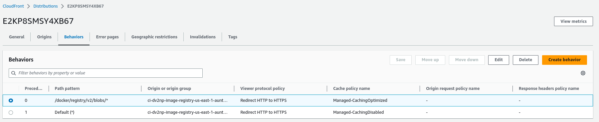
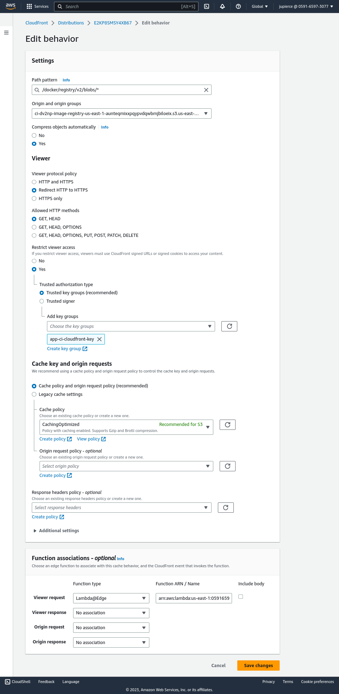

# Emergencies
If you believe this mechanism is causing issues with the registry, you can eliminate it as a possibility by
deleting the distribution's non-default behavior ([app.ci's behavior](https://us-east-1.console.aws.amazon.com/cloudfront/v3/home?region=us-west-2#/distributions/E2KP8SMSY4XB67/behaviors)). 
This will cause CloudFront to handle the requests directly. This will increase costs, but should restore functionality to supported OpenShift product behavior.
Note that all AWS build farms have their own CloudFront distribution configured for the registry (`oc get config.imageregistry.operator.openshift.io cluster -o yaml | yq -y '.spec.storage.s3.cloudFront'`) and share the exact same code in their non-default behavior. 

# Background
The app.ci registry (registry.ci.openshif.org) and the build farm container image registries transfer a huge amount
of data. For example, Each ephemeral cluster pulls GBs of data from the registry.

A default install of OpenShift creates an S3 bucket to store and serve its image registry content. In brief, when such a 
default registry pod receives a request for an image layer, it will compute a [presigned URL](https://docs.aws.amazon.com/AmazonS3/latest/userguide/ShareObjectPreSignedURL.html)
for the associated S3 object (served from the S3 HTTP endpoint) and return that URL as part of a redirect HTTP response to the client. The client
will then try an HTTP GET for the object. The S3 bucket HTTP service will validate the credentials in the presigned
URL and stream the data back to the client.

If the S3 bucket in this architecture is running in us-east-1 and the client is running in us-east-1 in a standard 
OpenShift install, this transfer of data is completely free. The problem with this solution is that app.ci
and all build farms reside in us-east-1, but not all clients are in us-east-1. For example, we stand up
ephemeral clusters for testing in us-west-2 or GCP. When the client is not in the same region as the S3 bucket, transfer
costs mount quickly. Transferring content to us-west-2 from us-east-1 costs 0.02 USD per GB. Transferring data to GCP
(which is just considered "the Internet" to AWS) costs between 0.05-0.09 USD per GB. When you are transferring TB of data,
this accumulates to a large monthly expense.

A partial solution to this is using CloudFront. AWS CloudFront can be enabled trivially in the OpenShift registry operator's
CRD. CloudFront can act as a CDN in front of the normal registry S3 bucket to more scalably transfer data from the bucket. 
The standard pricing for CloudFront is just as expensive (or more so) than just transferring from S3. However, we have a discount
which reduces the standard cost. 

So if we turn on CloudFront for our registries, transfers to GCP, for example, drop in cost. However, CloudFront will
also happily serve clients in us-east-1. This means our previously free transfers now incur charges.

# 1000 Foot View
CloudFront allows serverless functions to be [executed before processing a request itself](https://docs.aws.amazon.com/AmazonCloudFront/latest/DeveloperGuide/lambda-cloudfront-trigger-events.html). The serverless function can
modify the request or even respond to the client directly. This means we can write a request handler capable of detecting
the AWS region from which the client is making a request and redirecting it directly to S3 if we determine, for example,
that they are an EC2 instance in us-east-1.

So a client from us-east-1 requesting a blob would be processed as follows:
1. Make a GET request to registry.ci.openshift.org (`oc whoami -t` as the Authorization token).
2. The registry pod would verify the token and create a presigned URL for the configured CloudFront distribution and send a redirect for the client to the CloudFront URL.
3. The client receives the redirect and sends a GET to CloudFront. CloudFront verifies the presigned URL.
4. Our serverless function is invoked by CloudFront and detects that the client IP is from us-east-1.
5. Our serverless function creates a presigned URL for the registry's S3 storage bucket. It returns the presigned URL to the client as an HTTP redirect.
6. The client receives the redirect and sends a GET to the S3 HTTP service.
7. S3 validates the presigned URL and streams the content back to the client.
Cost: Free except for the low cost of the CloudFront GET request handling and serverless function execution time.

A client from GCP requesting a blob would be processed as follows:
1. Make a GET request to registry.ci.openshift.org (`oc whoami -t` as the Authorization token).
2. The registry pod would verify the token and create a presign URL for the configured CloudFront distribution and send a redirect for the client to the CloudFront URL.
3. The client receives the redirect and sends a GET to CloudFront. CloudFront verifies the presigned URL.
4. Our serverless function is invoked by CloudFront and detects that the client IP is NOT from AWS and allows the request to pass through to CloudFront.
5. CloudFront streams the content back to the client (CloudFront reads transparently from S3 when necessary and this read is free).
Cost: CloudFront GET request and serverless function execution time + Discounted CloudFront transfer cost.

# 100 Foot View
We can do even better! What if we had a replica of the app.ci registry in every major region (us-east-1, us-east-2, us-west-1, us-west-2)? 
If we did, then CloudFront could redirect the client to the "free" app.ci S3 replica bucket within its own region. 
The problem with this is that when a client pushes content registry.ci.openshift.org, it is only written to one S3 bucket (the one is us-east-1). 
To replicate the data, [S3 is set up with a replication job](https://aws.amazon.com/getting-started/hands-on/replicate-data-using-amazon-s3-replication/)
that will copy content to the other regions within 15 minutes.

Therefore, the content pushed to us-east-1 is not guaranteed to be on us-west-2 when a client from us-west-2 makes a request.
To account for this replication delay, the serverless function will query for the file in the client's regional replica. If it finds the file,
it will redirect the request to read from the replica S3 bucket directly. If it does not find the file, it will fall back to 
the next best option. For a client in us-east-2, the next best option is to read content from app.ci's us-east-1 bucket
(because east-1 to east-2 transfer is less expensive than a CloudFront transfer per GB if there is not NAT gateway
-- which is true for our build farms). For a client from us-west-2, the next best option is to stream the content from CloudFront.

# 10 Foot View
Each AWS build farm has its own CloudFront distribution in front of its S3 registry bucket. Our serverless function is configured
to execute as a behavior for these CloudFront distributions as well, but it behaves slightly differently than when it is running on an app.ci (registry.ci.openshift.org)
request. The build farm registries are not replicated in every region because the overhead of creating & replicating regional buckets
for every build farm is likely not worth the cost savings of transferring individual build farm images constructed solely for
specific CI builds. So, when a request comes in, the serverless function will first check to see if the client is in the us-east-1 
region (this is where all build farms reside). If the client is from us-east-1, then the client is redirected to read from the build 
farm registry's S3 bucket in us-east-1. If the client is not in us-east-1, the serverless function will check to see if the app.ci 
registry S3 replica in the client's region has the requested blob. app.ci will have a copy of this image more often than not
because MOST images for the payload are promoted to app.ci. The only images that will not be on app.ci are those that are built
on the build farms to service individual CI tests (e.g. the build of a specific component for a presubmit test.)

If the image does exist on app.ci, the client will be redirected to read from the app.ci replica in its region (exploiting low cost intra-regional transfer). 
If the file does not exist (because it was built directly on the build farm -- e.g. as part of a presubmit test -- or the 
15 minute replication has not happened for the image yet), then the serverless function will allow CloudFront to service the request 
(this will read from the build farm's S3 bucket and stream through CloudFront). 

# 0 Foot View
Final notes.

## Blobs vs Tags
The redirection logic is only active for blob content. Blobs are indexed in the file system via immutable sha256
filenames. Thus, we can safely serve them from any location because we can be certain the content is identical.
When, on the other hand, a client is trying to resolve an image tag, the serverless function passes the request
through directly to CloudFront. This ensures that the current value of that tag, according to the specific image registry
it was requested, is the value returned to the client. 

## Detecting Client Regions
It would not be performant to dynamically detect the region of a client IP. Instead, a precomputed map of IP
ranges is embedded in the serverless function source code. This map will occasionally need to be updated to
optimize the cost benefits (e.g. as AWS adds new regions, new IP ranges will come online; until the map is
updated, those regions will not find the optimal bucket).

## Updating
The function is saved as an AWS Lambda. For app.ci's account, you can find it [here](https://us-east-1.console.aws.amazon.com/lambda/home?region=us-east-1#/functions/cloudfront-us-east-to-s3-direct?tab=code).
1. Navigate to the Code tab. Update the code in the AWS console UI.
2. Click the `Deploy` button (this does not deploy to CloudFront -- don't worry).
3. Click the `Test` button to verify basic functionality.
4. Navigate to the Versions tab. Click the `Publish new version` version button (this does not deploy to CloudFront).
5. This will create a new version of the function (e.g. `25`).
6. Navigate to the registry's CloudFront behaviors ([app.ci's here](https://us-east-1.console.aws.amazon.com/cloudfront/v3/home?region=us-east-1#/distributions/E2KP8SMSY4XB67/behaviors)).
7. Edit the behavior for the `/docker/registry/v2/blobs/*` path pattern.
8. Scroll down to the `Function associations` section.
9. Update the tail end of the associated `Viewer request` function `Function ARN / Name` field to point to the new version.
10. Note you are not about to deploy to CloudFront. Click Save.
11. The CloudFront distribution will redeploy. You can watch its status on the [General](https://us-east-1.console.aws.amazon.com/cloudfront/v3/home?region=us-east-1#/distributions/E2KP8SMSY4XB67) tab. This takes several minutes.
12. Once the distribution states that it is deployed, your new code is being executed for registry requests for blobs.

## CloudFront Behavior Configuration





## NAT Gateway Considerations
To understand network transfer costs, it is vital to understand OpenShift's use of NAT gateways. In a default
install, any node in the OCP VPC will move all ingress/egress through the NAT gateway EXCEPT for content from
S3 in the same region as the node. This is because the default install includes a [Gateway Endpoint for S3](https://docs.aws.amazon.com/vpc/latest/privatelink/vpc-endpoints-s3.html).

This, for example, makes transfers from nodes in us-east-1 from an S3 bucket in us-east-1 free even if there
is an active NAT gateway (S3 goes through the Gateway Endpoint instead of the NAT gateway). However, a node
is us-east-2 would be charged for traffic from us-east-1 to us-east-2 AND the NAT gateway cost.

To limit costs, our build farms have been configured with public IP addresses and enabled to bypass the NAT
Gateway for all ingress traffic. This makes, for example, a node in us-east-2 reading from an S3 bucket
relatively inexpensive since traffic passes through the public IP and only inter-regional costs are encountered.

# Debugging
You can exercise the serverless function using any HTTP client by specifying the `user-agent` HTTP header to
trigger different flows through the code.

- A `user-agent` of `debugregistry/cloudfront` will always resolve the request through CloudFront. 
- A `user-agent` of `debugregistry/local` will always resolve the request to the build farm's local us-east-1 registry.
- A `user-agent` of `debugregistry/<region>` will resolve the requested content as if the client were in <region> (e.g. user-agent='debugregistry/us-east-2').

Where `token` is the value of `oc --context app.ci whoami -t` . 
```commandline
$ curl -L -v --http1.1 --user-agent 'debugregistry/us-west-2' -H "Connection: close" -H "Authorization: Bearer $token" -H "Accept: application/json" https://registry.ci.openshift.org/v2/ocp/4.11/blobs/sha256:25d51a8ddcd713bf7ab7db85fd215c302d7ab3995abace04f4fb25acc073e6ce
*   Trying 54.175.150.55:443...
* Connected to registry.ci.openshift.org (54.175.150.55) port 443 (#0)
* ALPN: offers http/1.1
* TLSv1.3 (OUT), TLS handshake, Client hello (1):
*  CAfile: /etc/pki/tls/certs/ca-bundle.crt
*  CApath: none
* TLSv1.3 (IN), TLS handshake, Server hello (2):
* TLSv1.3 (IN), TLS handshake, Encrypted Extensions (8):
* TLSv1.3 (IN), TLS handshake, Certificate (11):
* TLSv1.3 (IN), TLS handshake, CERT verify (15):
* TLSv1.3 (IN), TLS handshake, Finished (20):
* TLSv1.3 (OUT), TLS change cipher, Change cipher spec (1):
* TLSv1.3 (OUT), TLS handshake, Finished (20):
* SSL connection using TLSv1.3 / TLS_AES_128_GCM_SHA256
* ALPN: server accepted http/1.1
* Server certificate:
*  subject: CN=registry.ci.openshift.org
*  start date: Mar 17 05:01:11 2023 GMT
*  expire date: Jun 15 05:01:10 2023 GMT
*  subjectAltName: host "registry.ci.openshift.org" matched cert's "registry.ci.openshift.org"
*  issuer: C=US; O=Let's Encrypt; CN=R3
*  SSL certificate verify ok.
* using HTTP/1.1
> GET /v2/ocp/4.11/blobs/sha256:25d51a8ddcd713bf7ab7db85fd215c302d7ab3995abace04f4fb25acc073e6ce HTTP/1.1
> Host: registry.ci.openshift.org
> User-Agent: debugregistry/us-west-2
> Connection: close
> Authorization: Bearer <REDACTED>
> Accept: application/json
> 
* TLSv1.3 (IN), TLS handshake, Newsession Ticket (4):
* TLSv1.3 (IN), TLS handshake, Newsession Ticket (4):
* old SSL session ID is stale, removing


================THE REGISTRY POD IS ABOUT TO SEND THE 307 REDIRECT TO CLOUDFRONT. NOTE THE SIGNED URL WITH AN EXPIRATION DATE================

< HTTP/1.1 307 
< content-type: application/octet-stream
< docker-distribution-api-version: registry/2.0
< location: https://d1wgmlmph9kt2c.cloudfront.net/docker/registry/v2/blobs/sha256/25/25d51a8ddcd713bf7ab7db85fd215c302d7ab3995abace04f4fb25acc073e6ce/data?Expires=1683842210&Signature=Q7zqD0...&Key-Pair-Id=K2...
< x-registry-supports-signatures: 1
< content-length: 0
< date: Thu, 11 May 2023 21:36:50 GMT
< set-cookie: d745030f713162d9795f023046c43e8c=289314eb882dbcd0c9db4165c978578e; path=/; HttpOnly; Secure; SameSite=None
< connection: close
< 
* Closing connection 0
* TLSv1.3 (IN), TLS alert, close notify (256):
* TLSv1.3 (OUT), TLS alert, close notify (256):
* Issue another request to this URL: 'https://d1wgmlmph9kt2c.cloudfront.net/docker/registry/v2/blobs/sha256/25/25d51a8ddcd713bf7ab7db85fd215c302d7ab3995abace04f4fb25acc073e6ce/data?Expires=1683842210&Signature=Q7zqD0...Key-Pair-Id=K2...'
*   Trying 108.156.178.3:443...
* Connected to d1wgmlmph9kt2c.cloudfront.net (108.156.178.3) port 443 (#1)
* ALPN: offers http/1.1
* TLSv1.3 (OUT), TLS handshake, Client hello (1):
* TLSv1.3 (IN), TLS handshake, Server hello (2):
* TLSv1.3 (IN), TLS handshake, Encrypted Extensions (8):
* TLSv1.3 (IN), TLS handshake, Certificate (11):
* TLSv1.3 (IN), TLS handshake, CERT verify (15):
* TLSv1.3 (IN), TLS handshake, Finished (20):
* TLSv1.3 (OUT), TLS change cipher, Change cipher spec (1):
* TLSv1.3 (OUT), TLS handshake, Finished (20):
* SSL connection using TLSv1.3 / TLS_AES_128_GCM_SHA256
* ALPN: server accepted http/1.1
* Server certificate:
*  subject: CN=*.cloudfront.net
*  start date: Dec  8 00:00:00 2022 GMT
*  expire date: Dec  7 23:59:59 2023 GMT
*  subjectAltName: host "d1wgmlmph9kt2c.cloudfront.net" matched cert's "*.cloudfront.net"
*  issuer: C=US; O=Amazon; CN=Amazon RSA 2048 M01
*  SSL certificate verify ok.
* using HTTP/1.1
> GET /docker/registry/v2/blobs/sha256/25/25d51a8ddcd713bf7ab7db85fd215c302d7ab3995abace04f4fb25acc073e6ce/data?Expires=1683842210&Signature=......zjPRsmkCgtIRCicvz-~C5ytzRCss9OA41plNg__&Key-Pair-Id=K2SWMQXKFN57UD HTTP/1.1
> Host: d1wgmlmph9kt2c.cloudfront.net
> User-Agent: debugregistry/us-west-2
> Connection: close
> Accept: application/json
> 

================THE SERVERLESS FUNCTION HAS ANALYZED THE CLIENT, FOUND IT IS FROM us-west-2, FOUND THAT THE REQUEST BLOB IS AVAILABLE ON APP.CI'S us-west-2 REPLICA, AND IS SENDING US TO S3 TO GET IT================
================NOTE THE NEW SIGNED URL WHICH WILL AUTHORIZE THE S3 READ. IT ALSO EXPIRES================


* TLSv1.3 (IN), TLS handshake, Newsession Ticket (4):
< HTTP/1.1 307 CostManagementRedirect
< Content-Length: 0
< Connection: close
< Server: CloudFront
< Date: Thu, 11 May 2023 21:36:53 GMT
< Location: https://us-west-2-replica-of-ci-dv2np-image-registry-us-east-1.s3.amazonaws.com/docker/registry/v2/blobs/sha256/25/25d51a8ddcd713bf7ab7db85fd215c302d7ab3995abace04f4fb25acc073e6ce/data?X-Amz-Algorithm=AWS4-HMAC-SHA256&X-Amz-Credential=ASIAQ3...&X-Amz-Signature=...4c81
< X-Cache: LambdaGeneratedResponse from cloudfront
< Via: 1.1 5cf3f25bf905bc6e52b9e72f44811c98.cloudfront.net (CloudFront)
< X-Amz-Cf-Pop: CMH68-P2
< X-Amz-Cf-Id: 19g6pSik6ANoz8L_0hEoat7JKw0a-MhCNXWGt1lKB23a9mpGwPT8oQ==
< 
* Closing connection 1
* TLSv1.3 (IN), TLS alert, close notify (256):
* TLSv1.3 (OUT), TLS alert, close notify (256):
* Issue another request to this URL: 'https://us-west-2-replica-of-ci-dv2np-image-registry-us-east-1.s3.amazonaws.com/docker/registry/v2/blobs/sha256/25/25d51a8ddcd713bf7ab7db85fd215c302d7ab3995abace04f4fb25acc073e6ce/data?X-Amz-Algorithm=AWS4-HMAC-SHA256&X-Amz-Credential=ASIAQ3...&X-Amz-Signature=...4c81'
*   Trying 52.92.139.113:443...
* Connected to us-west-2-replica-of-ci-dv2np-image-registry-us-east-1.s3.amazonaws.com (52.92.139.113) port 443 (#2)
* ALPN: offers http/1.1
* TLSv1.3 (OUT), TLS handshake, Client hello (1):
* TLSv1.3 (IN), TLS handshake, Server hello (2):
* TLSv1.2 (IN), TLS handshake, Certificate (11):
* TLSv1.2 (IN), TLS handshake, Server key exchange (12):
* TLSv1.2 (IN), TLS handshake, Server finished (14):
* TLSv1.2 (OUT), TLS handshake, Client key exchange (16):
* TLSv1.2 (OUT), TLS change cipher, Change cipher spec (1):
* TLSv1.2 (OUT), TLS handshake, Finished (20):
* TLSv1.2 (IN), TLS handshake, Finished (20):
* SSL connection using TLSv1.2 / ECDHE-RSA-AES128-GCM-SHA256
* ALPN: server accepted http/1.1
* Server certificate:
*  subject: CN=*.s3.amazonaws.com
*  start date: Mar 21 00:00:00 2023 GMT
*  expire date: Dec 19 23:59:59 2023 GMT
*  subjectAltName: host "us-west-2-replica-of-ci-dv2np-image-registry-us-east-1.s3.amazonaws.com" matched cert's "*.s3.amazonaws.com"
*  issuer: C=US; O=Amazon; CN=Amazon RSA 2048 M01
*  SSL certificate verify ok.
* using HTTP/1.1
> GET /docker/registry/v2/blobs/sha256/25/25d51a8ddcd713bf7ab7db85fd215c302d7ab3995abace04f4fb25acc073e6ce/data?X-Amz-Algorithm=AWS4-HMAC-SHA256&X-Amz-Credential=ASI...%2Fus-west-2%2Fs3%2Faws4_request&X-Amz-Date=20230511T213653Z&X-Amz-Expires=1200&X-Amz-SignedHeaders=host&X-Amz-Security-Token=IQoJb3...&X-Amz-Signature=e8c7... HTTP/1.1
> Host: us-west-2-replica-of-ci-dv2np-image-registry-us-east-1.s3.amazonaws.com
> User-Agent: debugregistry/us-west-2
> Connection: close
> Accept: application/json
> 

================WE FINALLY GET AN HTTP 200 AND THE DESIRED CONTENT================


< HTTP/1.1 200 OK
< x-amz-id-2: u+lKueVp9LXwu+eM+jAGz3w0Odlc+FCpqYIOCieLkwUvEu+nyZYIfjW08qSSVk/n0sD0A8nliYM=
< x-amz-request-id: 45BSKNKNHWCEXY41
< Date: Thu, 11 May 2023 21:36:54 GMT
< x-amz-replication-status: REPLICA
< Last-Modified: Thu, 23 Mar 2023 19:33:16 GMT
< ETag: "a002b03c70d02fb4ba66d3673adbe176"
< x-amz-server-side-encryption: AES256
< x-amz-version-id: 7aeAExKuCeXnK5lEjwshVTeF2.uki78l
< Accept-Ranges: bytes
< Content-Type: application/octet-stream
< Server: AmazonS3
< Content-Length: 1249
< Connection: close
< 
{"schemaVersion":2,"mediaType":"application/vnd.docker.distribution.manifest.v2+json","config":{"mediaType":"application/vnd.docker.container.image.v1+json","size":24044,"digest":"sha256:176d7d21654eefb497b2a1765ed0e53015e184dfda7f856cc84a2dcdd587e0c1"},"layers":[{"mediaType":"application/vnd.docker.image.rootfs.diff.tar.gzip","size":79524639,"digest":"sha256:97da74cc6d8fa5d1634eb1760fd1da5c6048619c264c23e62d75f3bf6b8ef5c4"},{"mediaType":"application/vnd.docker.image.rootfs.diff.tar.gzip","size":1438,"digest":"sha256:d8190195889efb5333eeec18af9b6c82313edd4db62989bd3a357caca4f13f0e"},{"mediaType":"application/vnd.docker.image.rootfs.diff.tar.gzip","size":27361092,"digest":"sha256:848d9bc3d703a588186bcd58d19f0b3eff6ad44c9913ebdb0c2ca370df7d8848"},{"mediaType":"application/vnd.docker.image.rootfs.diff.tar.gzip","size":12406704,"digest":"sha256:49bbd08df6772274c74fa12419e966f98c5ed05e87e4d0404509d9bd420cedbe"},{"mediaType":"application/vnd.docker.image.rootfs.diff.tar.gzip","size":487678,"digest":"sha256:35d78a94* Closing connection 2
* TLSv1.2 (IN), TLS alert, close notify (256):
* TLSv1.2 (OUT), TLS alert, close notify (256):
a47acf2651bb2f21f00596e66d206baabd758309eceb70e8513dd3cf"},{"mediaType":"application/vnd.docker.image.rootfs.diff.tar.gzip","size":51970294,"digest":"sha256:d2c9503ba536ec4d6572775b66938a0f0ab2f2dbd492b6e381df3e9860131a08"}]}
```